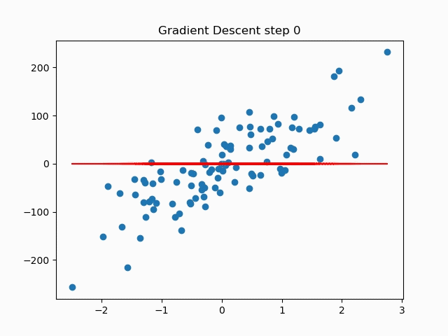

# Basic Animation with Matplotlib and Plotly.

## The shortest path to simple animation with the most popular plotting libraries for python

Sometimes it just makes sense to animate a visual. Animation can help understand data in a more complete way. If your medium is the screen you may find yourself needing to animate occasionally. The next question you ask will be, “which toolkit should I use for the animation.”  In the Jupiter notebook in this repository I compare the process for creating a basic animation like the one below with [Matplotlib](#eb2d) and [Plotly](#685f).

Follow along with the medium blog post.

The animations:

